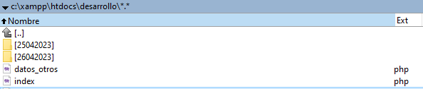

# Lista de ejercicios realizados en el curso «IFCD0210_DESARROLLO APLICACIONES CON TECNOLOGÍAS WEB»

# Espacio de trabajo de PHP

-   Carpeta DESARROLLO

El archivo `index.html` (o `index.php`) contendrá el ejercicio *en curso*. A medida que se realicen ejercicios nuevos, cada `index.html` será renombrado con un nombre **único**. 

A final del día todos los ejercicios realizados se guardarán en un *subdirectorio* con la **fecha** del día.

Estructura de carpetas:

[]